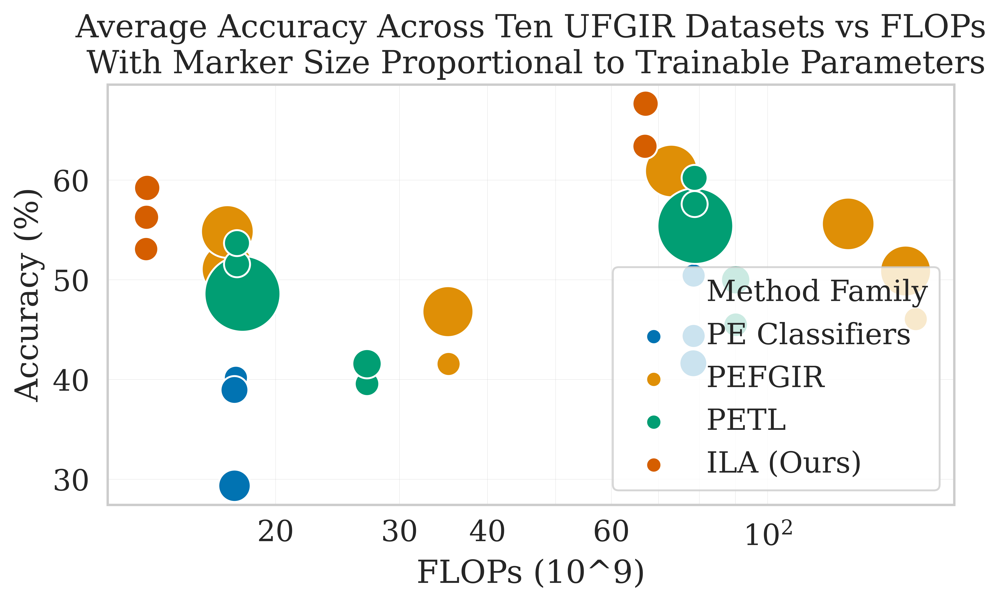

# Down-Sampling Inter-Layer Adapter for Parameter and Computation Efficient Ultra-Fine-Grained Image Recognition

Official Pytorch code for the paper: [Down-Sampling Inter-Layer Adapter for Parameter and Computation Efficient Ultra-Fine-Grained Image Recognition](https://arxiv.org/abs/2409.11051).

We propose a novel down-sampling adapter module inserted in between transformer
encoder layers to adapt and down-sample features in the parameter-efficient
transfer-learning setting:


Our method obtains favorable results across ten ultra-fine-grained image recognition
(UFGIR) datasets:


We incorporate spatial down-sampling to alleviate the attention collapse issue
observed in ViTs in the PETL setting:


Also, our method achieves a superior accuracy vs cost (in terms of total
trainable parameters and FLOPs) trade-off compared to alternatives.



Pre-trained checkpoints are available on [HuggingFace](https://huggingface.co/NYCU-PCSxNTHU-MIS/DownSamplingInterLayerAdapter)!

The code for our model (and the ViT backbone) is in `fgir_vit/model_utils/modules_others/adapters.py`.


## Setup

```
pip install -e . 
```


## Preparation

Datasets are downloaded from:
```
Xiaohan Yu, Yang Zhao, Yongsheng Gao, Xiaohui Yuan, Shengwu Xiong (2021). Benchmark Platform for Ultra-Fine-Grained Visual Categorization BeyondHuman Performance. In ICCV2021.
https://github.com/XiaohanYu-GU/Ultra-FGVC?tab=readme-ov-file
```


## Train

To train a `ViT B-16` with `ILA++` on CUB using image size 224:

```
python tools/train.py --serial 1 --cfg configs/soylocal_ft_weakaugs.yaml --model_name vit_b16 --freeze_backbone --classifier cls --adapter adapter --ila --ila_locs --cpu_workers 8 --seed 1 --lr 0.1
```

Similarly, for image size 448:
```
python tools/train.py --serial 3 --cfg configs/soylocal_ft_weakaugs.yaml --model_name vit_b16 --freeze_backbone --image_size 448 --classifier cls --adapter adapter --ila --ila_locs --cpu_workers 8 --seed 100 --lr 0.1
python tools/train.py --cfg configs/cub_ft_is224_medaugs.yaml --lr 0.01 --model_name vit_b16 --cfg_method configs/methods/glsim.yaml --image_size 448
```


## Compute CKA Similarity

For frozen vanilla ViT B-16
```
python -u tools/compute_feature_metrics.py --debugging --serial 32 --cfg configs/soyageing_ft_weakaugs.yaml --model_name vit_b16 --fp16 --compute_attention_cka --ckpt_path ckpts/soyageing_vit_b16_cls_fz_1.pth
```

For frozen ViT B-16 with our proposed ILA:

```
python -u tools/compute_feature_metrics.py --debugging --serial 32 --cfg configs/soyageing_ft_weakaugs.yaml --model_name vit_b16 --fp16 --compute_attention_cka --ckpt_path ckpts/soyageing_vit_b16_ila_dso_cls_adapter_fz_1.pth --adapter adapter --ila --ila_locs
```

Results will be saved in `results_inference` directory.


## Visualize attention

For ViT with ILA to visualize attention rollout for the 1st encoder group (first 4 encoder blocks: 0_4):

```
python -u tools/vis_dfsm.py --batch_size 8 --vis_cols 8 --vis_mask rollout_0_4 --serial 30 --cfg configs/soyageing_ft_weakaugs.yaml --model_name vit_b16 --fp16 --ckpt_path ../results_ila/serial1_ckpts/soyageing_vit_b16_ila_dso_cls_adapter_fz_1.pth --adapter adapter --ila --ila_locs
```

# Citation
If you find our work helpful in your research, please cite it as:

```
[1] E. A. Rios, F. Oyerinde, M.-C. Hu, and B.-C. Lai, “Down-Sampling Inter-Layer Adapter for Parameter and Computation Efficient Ultra-Fine-Grained Image Recognition,” Sep. 17, 2024, arXiv: arXiv:2409.11051. doi: 10.48550/arXiv.2409.11051.
```

# Acknowledgements
We thank NYCU's HPC Center and National Center for High-performance Computing (NCHC) for providing computational and storage resources. 

We thank the authors of [TransFG](https://github.com/TACJu/TransFG), [FFVT](https://github.com/Markin-Wang/FFVT), [SimTrans](https://github.com/PKU-ICST-MIPL/SIM-Trans_ACMMM2022), [CAL](https://github.com/raoyongming/CAL), [MPN-COV](https://github.com/jiangtaoxie/MPN-COV), [VPT](https://github.com/KMnP/vpt), [VQT](https://github.com/andytu28/VQT), [ConvPass](https://github.com/JieShibo/PETL-ViT/tree/main/convpass) and [timm](https://github.com/huggingface/pytorch-image-models/) for providing implementations for comparison. We also thank the authors of the [Ultra-FGVC](https://github.com/XiaohanYu-GU/Ultra-FGVC) datasets.

Also, [Weight and Biases](https://wandb.ai/) for their platform for experiment management.
 
